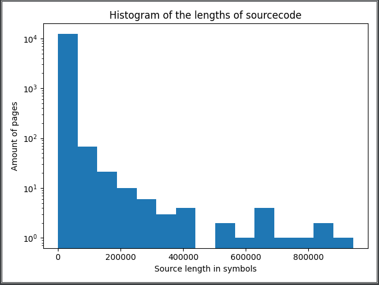
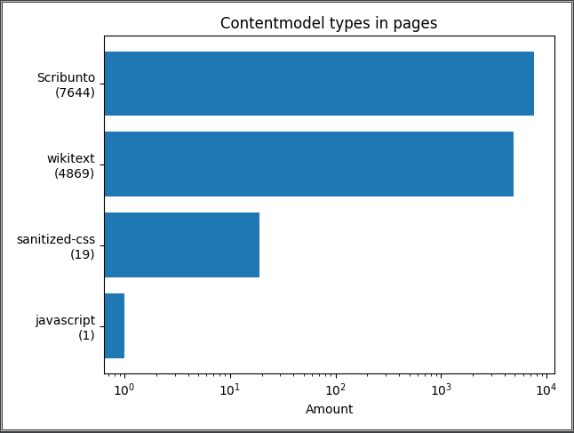
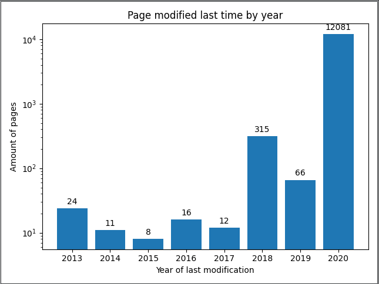
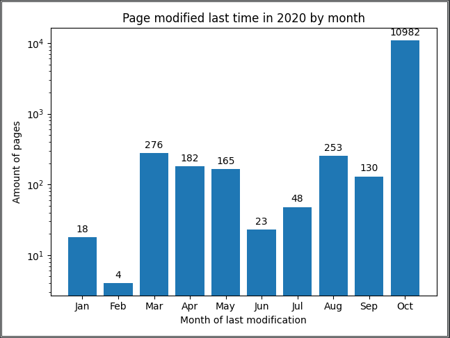

## Summary report for Wikimedia microtask ([T263678](https://phabricator.wikimedia.org/T263678 "Phabricator link"))

### Task

1. Write a script that fetches all of the source code on English Wikipedia in the Module: "namespace". 
Hint: we have APIs that will make your life easier and you can find good examples of how to call the APIs by using 
your favorite search engine or looking at some of the tools on Toolforge. 
Please try to limit the number of page or API fetches to one per second. 
We also have dumps with the same content that can analyzed offline.

2. Generate a summary report that includes interesting statistics like number of modules, 
a histogram of file sizes, and so on.

### Solution idea

From the first look the basic idea was to split the task into 3 parts:

1. Fetch all the sourcecode of the pages in Module: "namespace".
2. Fetch additional data, that can be analyzed for getting more interesting statistics.
3. Generate a report, based on previously loaded information.

### Solution

In this part the implementation of previously mentioned steps will be explained. 
Additionally I'll provide names of some of the functions connected to these steps.

These steps were implemented with the idea that all of them can be used separately, maybe in different work sessions.
However, the overall order _should not_ be changed, as most of the functions don't check whether used fields 
exist in the database or not.

The decision to store information in the database was made because Sqlite is built-in library for Python,
so it doesn't make you install anything, and storing things in database is a good way to save information 
and avoid parsing at the same time.

Moreover, commentaries are provided to each function to help understand the code and to make further usage
and/or modification of the program easier. 

##### _Step 1 – fetching the sourcecode_

Working on the first task had to be divided into 2 substeps, because of the way Wikimedia API is made.
First one is to get IDs of the pages in the Module: "namespace", second one is to get the sourcecode of each page 
using these IDs.

First substep is implemented by function `modules_fill_basic_table()`. In short, it does these things:

- creates a database for storing all the data;
- makes query allpages request (noted in Phabricator comments) for fetching IDs and titles of pages in the module;
- parses the returned json by searching keys we are interested at;
- saves obtained information in the database.

The second substep is implemented by function `modules_load_sources()`. What it does is:

- get IDs of pages, which source is saved as NULL in database, as they are considered not stored;
- makes parse request with IDs of pages with no saved sourcecode;
- parses returned json request and saves obtained sourcecode into the table.

Checking for NULL in source column is needed as downloading of all the sources takes a lot of time, 
and this implementation makes possible to load the information in several consecutive launches. 

##### _Step 2 – fetching additional info_

The second step is implemented by function `modules_load_additional_data()`, 
which structure resembles previous modules:

- adding columns to the table in the database for storing additional information;
- getting IDs of the pages, stored in the database;
- fetching new data with query prop=info request for batch of IDs from previous paragraph;
- parsing request answer and saving it to the table.

##### _Step 3 – generating statistics_

This part of the problem is coded into `modules_statistics()`. The module works with length of saved files,
specified contentmodel and datetime of last modification – "touched". It loads information from the database 
and then plots graphics using matplotlib.
 
### Analytics

Amount of pages in Module:namespace - 12533.

Pages with IDs [41871839](https://en.wikipedia.org/wiki/Module:Jct/city/Chinissai) 
and [41627197](https://en.wikipedia.org/wiki/Module:Jcttop/core/Chinissai) 
throw an exception, and their sourcecode can not be obtained because of that.
Additionally, 9 more pages have no sourcecode, so they are not used, and their length is 0.

Maximum source code length is 942724 symbols, mean source code length is 4293 symbols.

